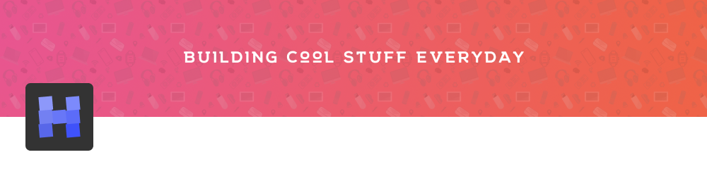

> "Everything has a trade-off" - Hasnayeen

### Hi 👋, I'm Nehal Hasnayeen

I'm a full stack developer currently residing in Bogura, Bangladesh.

🛠 created:

*Goodwork* - self hosted project management & collaboration tool built with Laravel. [Goodwork](https://github.com/iluminar/goodwork)

🔭 working on:

*Zukoni* html elements gallery built with TailwindCSS. [Website](https://zukoni.com)

💬 Ask me about:

PHP, Laravel, Tailwind, Docker etc.

📫 Reach me at:

Best way to reach me is at my email hasnayeen@pm.me